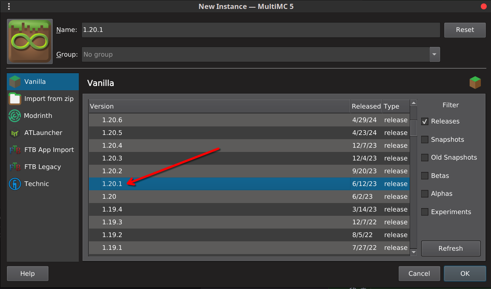
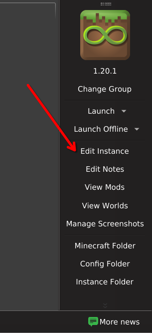
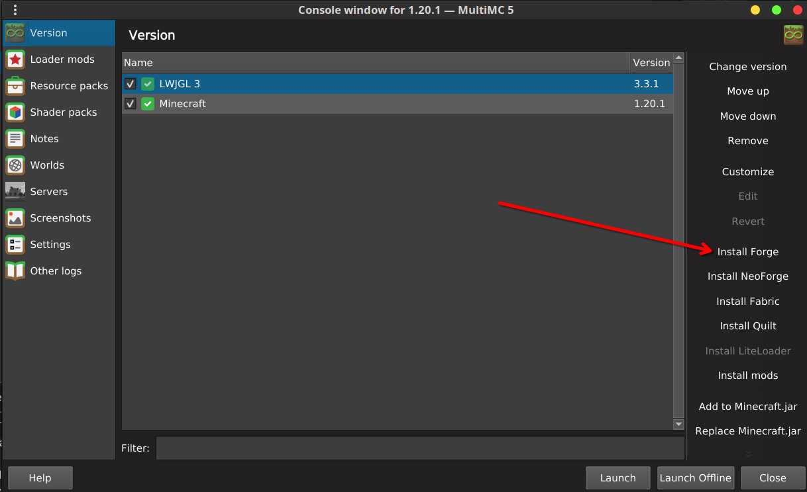
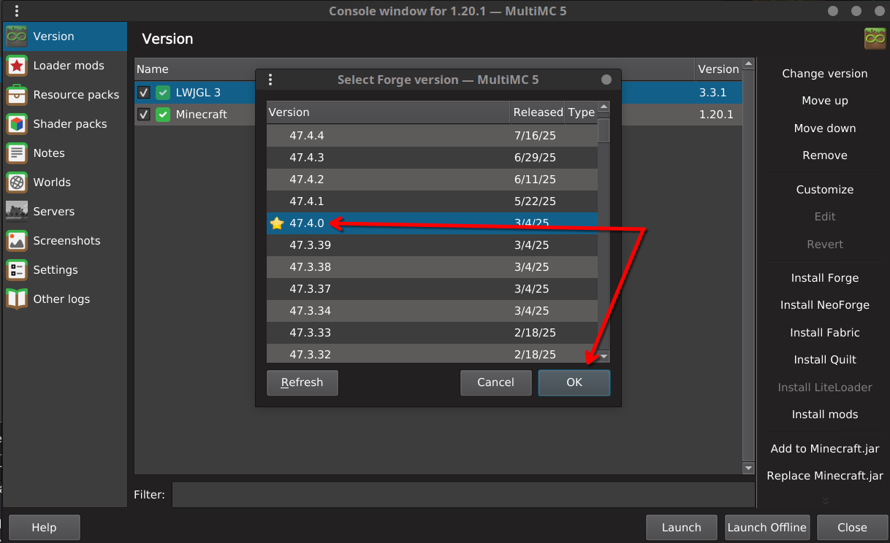
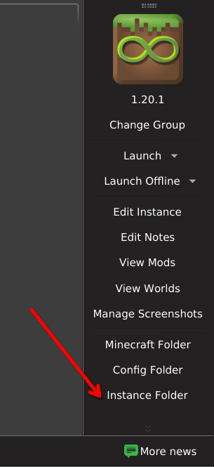

# AstroRise Modpack

`minecraft 1.20.1` `forge 47.4.0`


This repository contains the files for the Astro Rise modpack, along with a Python-based installer to help set it up.

### Client Installation (for MultiMC)

1.  Download the repository as a ZIP file and unzip it, or clone it.
2.  Copy the entire content of the repository into your new MultiMC instance folder.
3.  Run the installer in `client` mode from a terminal inside the instance folder:
    ```bash
    python installer.py client
    ```
4.  The script will verify your Minecraft and Forge versions and synchronize all the necessary configs, scripts, and mods.

### Server Installation

The server installation process is not yet implemented.
=======
# Astro Rise Modpack

This repository contains the files for the Astro Rise modpack, along with a Python-based installer to help set it up.

## Client Installation Guide (for MultiMC)

This guide will walk you through creating a new instance and installing the modpack.

### Step 1: Create Instance & Select Minecraft Version

In the main MultiMC window, click **"Add Instance"**. A dialog box will appear.

Select the version of Minecraft that matches the one specified in `manifest.json` (currently **1.20.1**). You can leave the name as default for now.



Click **"OK"**.

### Step 2: Edit the New Instance

With your new instance created, select it and click **"Edit Instance"** from the right-hand menu.



### Step 3: Install Forge

In the "Version" tab of the instance editor, click **"Install Forge"** on the right side.



### Step 4: Select Forge Version

A new window will open. Select the version of Forge that matches the one specified in `manifest.json` (currently **47.4.0**).



Click **"OK"**. MultiMC will now install the modloader.

### Step 5: Open the Instance Folder

Once the modloader is installed, return to the main MultiMC window. Right-click on your instance and select **"Instance Folder"**.



This will open the folder where the instance's files are stored.

### Step 6: Copy Repository Files & Run Installer

Now, you will set up the modpack itself.

1.  Download or clone this repository. Copy the **entire contents** of the repository (the `astro-rise` folder, `manifest.json`, `installer.py`, etc.) directly into the instance folder you just opened.
2.  **!!! CLOSE MULTIMC !!!** Before running the installer, make sure the MultiMC application is **completely closed**. This is critical.
3.  Open a terminal or command prompt inside the instance folder and run the installer script:
    ```bash
    python installer.py client
    ```
4.  The script will ask you to confirm that MultiMC is closed. Press Enter to proceed.

Once the script is finished, you can re-open MultiMC, and your Astro Rise instance will be ready to play!
